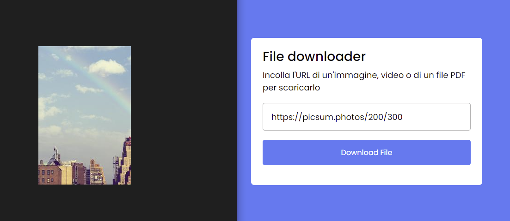

# Progetto Javascript file downloader

Progetto piuttosto semplice che integra un downloader di file o immagini dalla rete. Tutte le funzioni e i metodi per il corretto funzionamento dell'app sono stati implementati grazie a JS Plain.

- HTML (Markup)
- CSS (Markup)
- JAVASCRIPT

Condizione iniziale dell'app

Link incollato nell'input. Il pulsante di download si attiva soltanto in caso di un link incollato

Scaricamento e download del file

Immagine scaricata presente nella cartella locale di download

